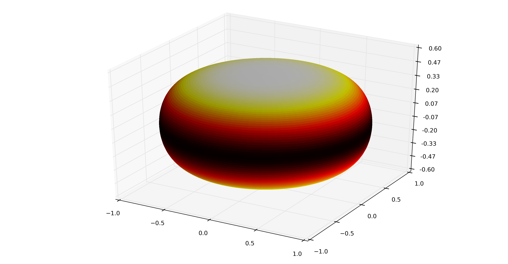
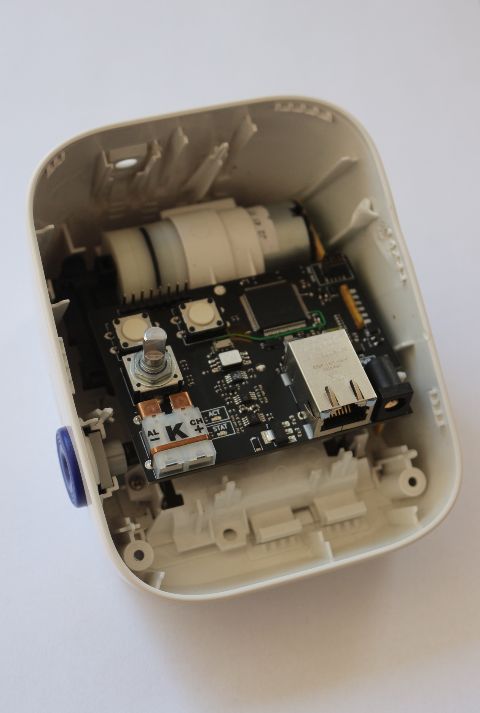
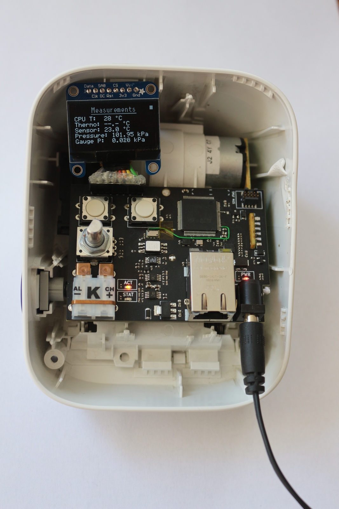

# _Alakol_

The non-uniform stress / strain accross a balloon's surface is of interest
for superpressure balloon design. Additionally the technique of
"pre-stretching" can be used to modify the balloon's surface stress
distribution.

**Example plot of stress in a mylar balloon shape, before pre-stretching**

However the understanding of this process, especially for the [mylar
balloon][mylar-balloon] shape popular among amateurs for its simplicity,
has not developed much beyond alchemy. At least in part this is due to a
lack of data and repeatable experiments, and difficulties in controlling
external variables given that some experiments last for 10s of hours.

_Alakol_ is a specialised datalogger for collecting data about the
pre-stretching process. It measures:

- **Gauge pressure** the difference in pressure between inside the balloon
  envelope and outside
- **Ambient temperature** using a K-Type thermocouple
- **Absolute ambient pressure** which can be used to remove any effect
  from ambient pressure changing over time
- **Board Temperature** used as the cold-junction temperature for the
  thermocouple and also useful for calibrating the gauge pressure
  measurement against temperature

The _Alakol_ re-uses the mechanical elements from an Omron M2 Blood
Pressure Monitor (BPM). It can pump ambient air into a +ve pressure up to
~40kPa at a (roughly) constant rate, and then release this pressure via a
solenoid controlled valve. This is not the first superpressure balloon
project to re-use the Omron M2 BPM (was this Leo?) but it takes the
additional step of building a datalogger around it.

🚧🚧🚧🚧
WARNING: The Omron M2 Blood Pressure Monitor is a consumer medical device,
but after the modifications described here it is **no longer suitable for
its original purpose** nor should it be used on people (or anything alive
really). Before modifying an Omron M2 you must ensure it is surpless to any
medical requirements, and that it is clearly marked as non-medical. After
modification the original display panel will no longer fit, which ensures
the extent of the modification is abundantly clear to anyone. The Ormon M2
can usually be purchased off the shelf at consumer stores.
🚧🚧🚧🚧🚧

Project Goals:

- Measure all of the obvious enviromental variables.
- Be pleasant to use.

Not a Goal:

- Be very low cost.

### Hardware

The hardware is a 1.6mm thick 4-layer PCB that replaces all of the internal
PCBs in the M2, except from the motor / value breakout PCB (which has no
components anyhow).

The hardware is designed in KiCad. See the [hardware](hardware/) directory.

### Firmware

The firmware runs on a STM32 microcontroller, and is written in Rust. See
the [firmware](firmware/) directory.

A small [OLED display][adafruit-938] displays measurements, and a very
simple user interfaces allows you to cycle between screens, control the
motor and valve, and zero the gauge pressure reading.

Over Ethernet, it offers a HTTP server for commanding the motor and valve,
whilst a separate TCP server on port 8080 streams the measurement data at a
10Hz update rate.

### Data Analysis

There are some python scripts. See the [software](software/) directory.

### License

See each section (hardware/firmware/software).

[mylar-balloon]: https://www.wikipedia.org/wiki/Mylar_balloon_(geometry)
[adafruit-938]: https://www.adafruit.com/product/938
