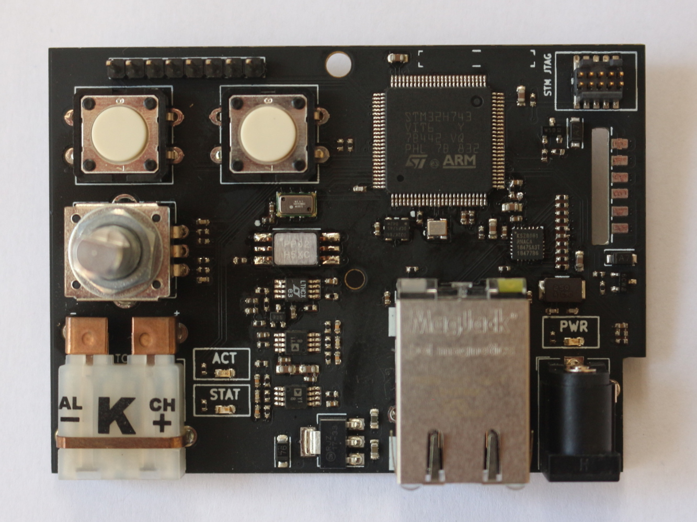
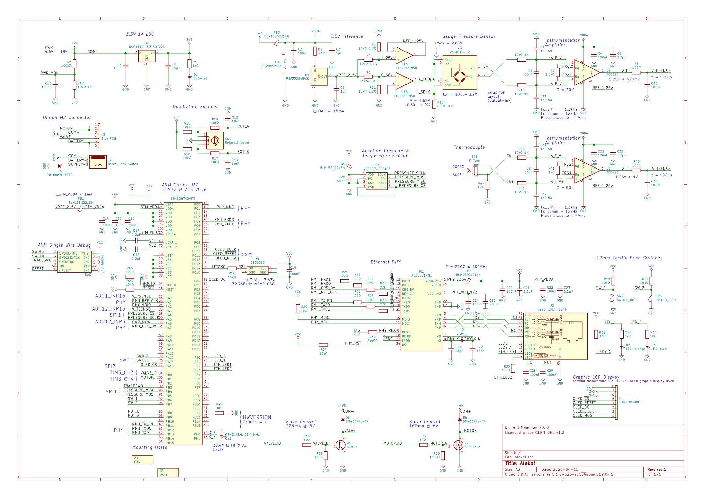

# _Alakol_ hardware
## Replacement control board for the Omron M2

---

## Hardware Overview

* Omron 2SMPP-02 gauge pressure sensor
  * Resistive wheatstone bridge
  * TI REF3325 + LTC2064 to provide constant current source
  * AD8226 In-Amp
* MS5607 Sensor
  * Ambient Pressure
  * Board Temperature (close to 2SMPP-02)
* K-Type Thermocouple (Al/Ch)
  * AD8226 In-Amp
* Microcontroller
  * STM32H743VIT6
  * KSZ8081RN Ethernet PHY
* DC Power Jack
  * Centre +ve
  * 4.6V - 18V
  * Or 4xAA batteries!
* Fits in existing Omron M2 housing
  * Dimensions: 78.0mm x 56.0mm (3.07" x 2.20")

| | |
| --- | --- |
| Schematic | [svg](output/schematic/svg/alakol.svg)/[pdf](output/schemati/pdf/alakol.pdf)
| BOM | [csv](output/bom/bom.csv)
| Layout | [svg](output/layout/svg)/[pdf](output/layout/pdf)/[dxf](output/layout/dxf)
| Gerbers | [gerbers](output/layout/gerber)

---

## License

Hardware is licensed under CERN OHL v1.2. See [LICENSE.md](LICENSE.md)
