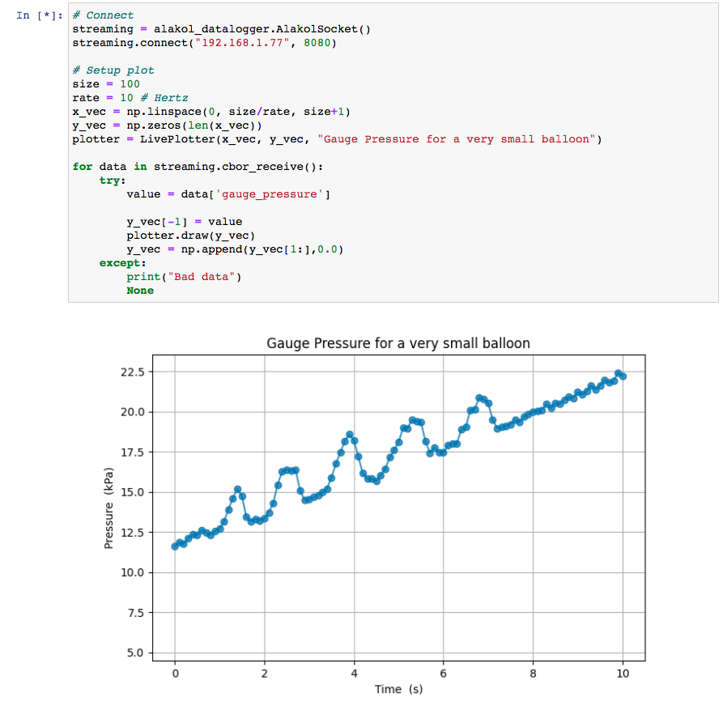

_Alakol_ software
======

A selection of scripts for capturing data / commanding _alakol_. Data is
streamed over TCP port 8080 in [CBOR](https://cbor.io/) packed format. The
control interface is a HTTP server on TCP port 80.

For live streaming data, there is a jupyter notebook.



# Getting Started

These are python3 scripts, it's a good idea to run them in an virtual
enviroment (venv). You can set this up and install dependancies like so:

```
python3 -m venv venv
source venv/bin/activate
pip install -r requirements.txt
```

## On Windows

Maybe this works under WSL?

# Standalone Examples

### Logging to CSV file

```
python alakol_datalogger.py --filename pressure_log1 192.168.xx.xx
```

### Sending commands:

See [profile_example.py](profile_example.py)

# Usage from a python script

The `AlakolSocket` class provides a method `cbor_receive` that yields each
datapoint.

```python3
from alakol_datalogger import AlakolSocket

# Connect
streaming = AlakolSocket()
streaming.connect("192.168.x.x", 8080)

# Iterate over received datapoints
for idx, data in enumerate(streaming.cbor_receive()):
    gauge_pressure = data["gauge_pressure"]
    print(gauge_pressure)
```

Commanding is even easier. Under the hood this uses [requests](https://requests.readthedocs.io/).

```python3
from alakol_command import AlakolCommand

# Connect
alakol = AlakolCommand("192.168.x.x")

# Set motor state (percentage) and value (True = close, False = open)
alakol.command(80, True)     # Inflate at 80%
```

# License

[MIT](LICENSE.md)
